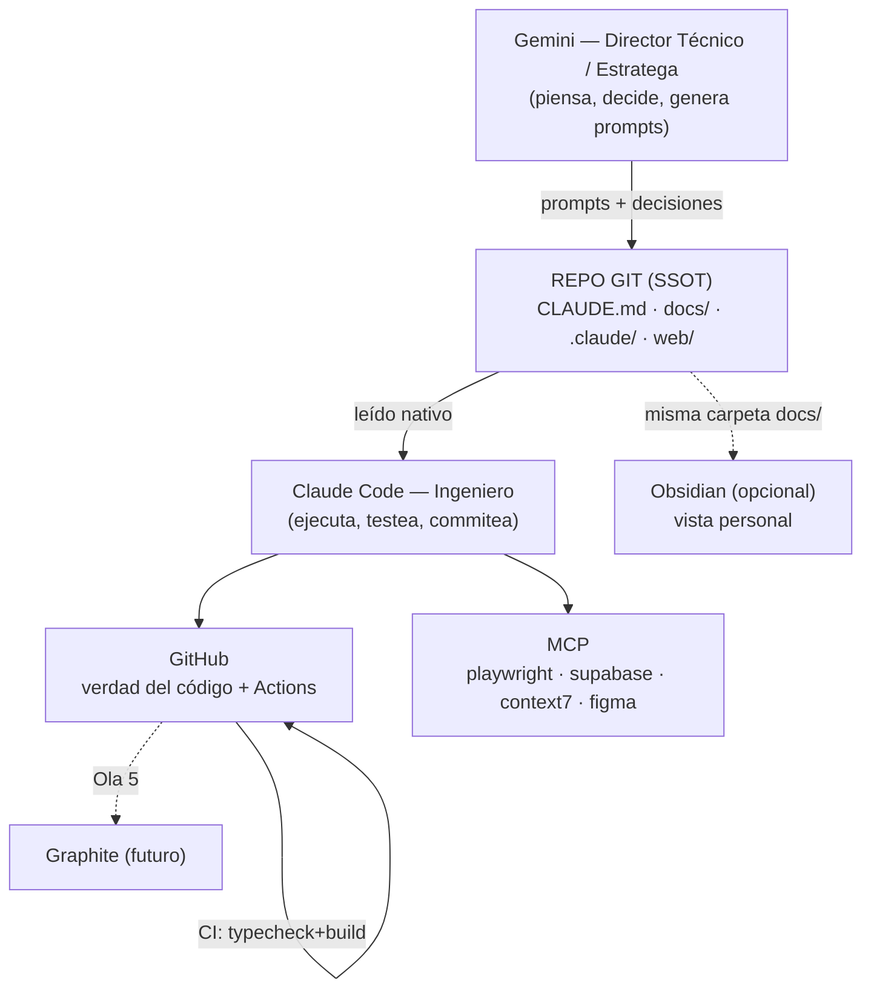

# 02 — Arquitectura

## Propósito
Explicar cómo se conectan todas las piezas del ecosistema y quién hace qué.

## Alcance
La arquitectura del ECOSISTEMA de trabajo (no la del producto, que hoy no existe — ver `11-BACKEND.md`). La estructura del repo está en detalle abajo.

## Principio rector
**Una sola fuente de verdad = el repo git.** Cero puentes que deriven. Cada capa lee lo que ya está versionado.

## Diagrama — flujo del ecosistema


## Roles
- **Gemini** = Director Técnico / Arquitecto: investiga, audita, propone, genera prompts. NO escribe código. (ver `04-GEMINI.md`)
- **Claude Code** = Ingeniero: ejecuta, prueba, commitea. Valida contra el código real. (ver `03-CLAUDE-CODE.md`)
- **GitHub** = verdad del código + host de automatización (ver `08-GITHUB.md`)
- **MCP** = brazos del agente (ver `06-MCP.md`)
- **Obsidian** = vista personal de `allimport/docs/`, fuera del loop del agente.

## Matiz importante (honestidad de ingeniería)
Gemini "decide" a nivel estrategia, pero **la validación final es contra el código real**, que solo ve Claude Code. Flujo sano: **Gemini propone → Claude Code verifica en el repo → se ejecuta.** Gemini no es omnisciente sobre el estado del código.

## Estructura del repo
```
CLAUDE.md              memoria del agente
docs/                  SSOT (00..16 + decisions/)
.claude/               settings.json, agents/, skills/ (symlinks)
skills/                biblioteca de skills (77)
web/                   landing Next.js 15 + R3F
_research/             conocimiento (plan maestro, análisis videos/fotos, prompts)
.github/workflows/     ci.yml (gate) + pages.yml (deploy)
```

## Qué NO hace
No documenta el producto (no existe). No reemplaza a los archivos por área.

## Buenas prácticas
- Todo lo que un agente necesita, versionado.
- Diagramas en Mermaid (se renderizan en GitHub).

## Errores comunes
- Un segundo almacén de verdad (Obsidian/Notion) que deriva → prohibido.
- MCP redundantes (filesystem/git ya son nativos) → se sacaron.

## Checklist
- [ ] ¿La info nueva vive en el repo?
- [ ] ¿Algún componente duplica a otro?

## Mejoras futuras
Sumar el producto (Ola 4) al diagrama cuando exista.
