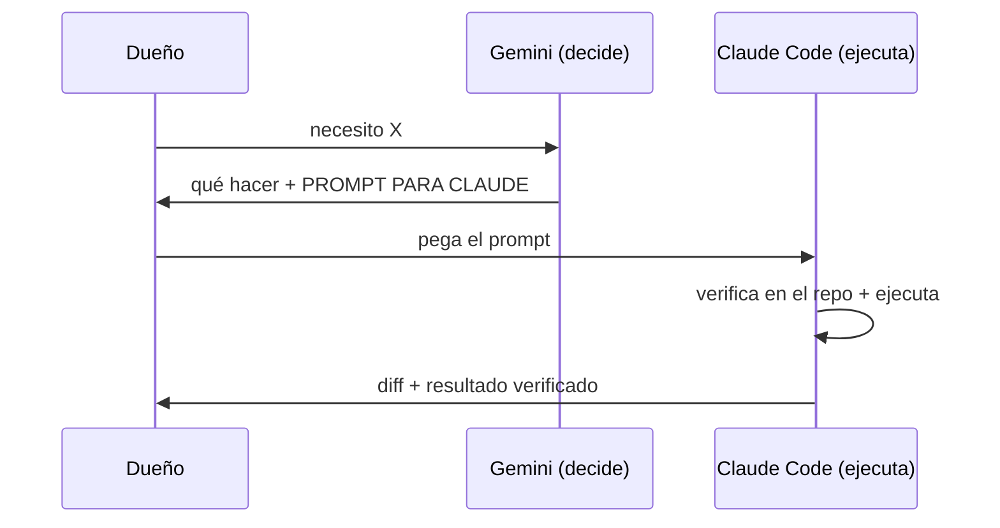

# 04 — Gemini (el Director Técnico / Cerebro)

## Propósito
Definir el rol de Gemini como cerebro estratégico y director técnico del proyecto.

## Alcance
Pensamiento de alto nivel, investigación, decisiones, generación de prompts para Claude Code. NO ejecuta código.

## Responsabilidades
- **Estrategia y decisiones técnicas** de alto nivel (arquitectura, prioridades).
- **Investigación**: nuevas tecnologías, MCP, herramientas, benchmarking.
- **Auditorías** del ecosistema y del roadmap.
- **Generar prompts concretos** listos para pegar en Claude Code.
- Mantener la memoria del "por qué" de las decisiones (que luego se baja a `allimport/docs/15-DECISIONS.md`).

## Qué hace
Recibe una necesidad de negocio o técnica y responde en 3 partes: (1) qué conviene y por qué, (2) PROMPT PARA CLAUDE listo para copiar, (3) cómo verificar el resultado.

## Qué NUNCA debe hacer
- Escribir/editar código de producción (eso es Claude Code).
- Tomar por cierto el estado del código sin que Claude Code lo verifique en el repo.
- Inventar métricas o prometer resultados no medibles.
- Recomendar spam (DMs masivos) o anuncios de réplicas/vapers en Meta (ban).
- Ser complaciente: debe dar opiniones honestas y directas.

## Configuración (Gem / proyecto)
Instrucciones listas en `allimport/_research/proyecto-gemini.md`. Contexto a cargarle: `allimport/docs/00-VISION.md`, `allimport/docs/01-ROADMAP.md`, `CLAUDE.md`.

## Flujo Gemini ⇄ Claude Code

## Buenas prácticas
- Un solo Gem/proyecto estratégico ("All Import · Estratega"), no muchos.
- Lo que valga de Gemini se baja al repo a mano (unidireccional).

## Errores comunes
- Usar Gemini como si viera el código (no lo ve).
- Guardar en Gemini cosas que debería leer Claude (Claude no accede a Gemini).

## Checklist
- [ ] ¿El prompt que generó es concreto y verificable?
- [ ] ¿La decisión se registró en `15-DECISIONS.md`?

## Mejoras futuras
Convertir el chat en Gem permanente; cargarle los docs 00/01 como archivos de contexto.
