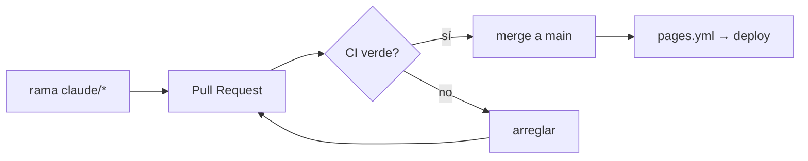

# 08 — GitHub

## Propósito
Definir el flujo de trabajo con GitHub: ramas, PRs, CI, releases, deploy.

## Alcance
Repo `allimport/allimport-skill`. GitHub = verdad del código + host de automatización.

## Ramas
- Default: rama principal (protegida idealmente).
- Trabajo: `claude/<descripcion>` (ej. `claude/skills-workflow-audit-22vj5r`).
- **Trunk-based**: ramas cortas, PRs chicos, merge rápido. NO GitFlow (develop/release/feature largas).

## Pull Requests
- Un cambio lógico = una rama = un PR.
- Debe pasar el CI (typecheck + build) antes de mergear.
- Revisión con subagente `reviewer` antes de abrir.

## CI (`.github/workflows/ci.yml`)
En cada PR que toca `web/`: `npm ci` → `tsc --noEmit` → `npm run build`. (Sin `next lint` standalone: está deprecado y el build ya valida lint/tipos internamente.)

## Deploy (`.github/workflows/pages.yml`)
Push → build de `web/` con `BASE_PATH=/allimport-skill` → export estático → push a `gh-pages` (GitHub Pages).

## Releases
Hoy no hay versionado formal (landing de deploy continuo). Cuando exista producto: tags semver + changelog.

## Diagrama

## Qué NO hacer
- `push --force` a main. `add -A` a ciegas. Commitear secretos.
- Mergear con CI en rojo.

## Buenas prácticas
- Commits claros, un cambio por commit.
- Branch protection con el check de CI requerido.

## Errores comunes
- PRs gigantes (difíciles de revisar).
- Olvidar que `pages.yml` deploya en push.

## Checklist de PR
- [ ] CI verde · [ ] diff revisado · [ ] sin secretos · [ ] descripción clara.

## Mejoras futuras
Claude Code GitHub Action (`@claude`) · branch protection · auto-merge en verde.
